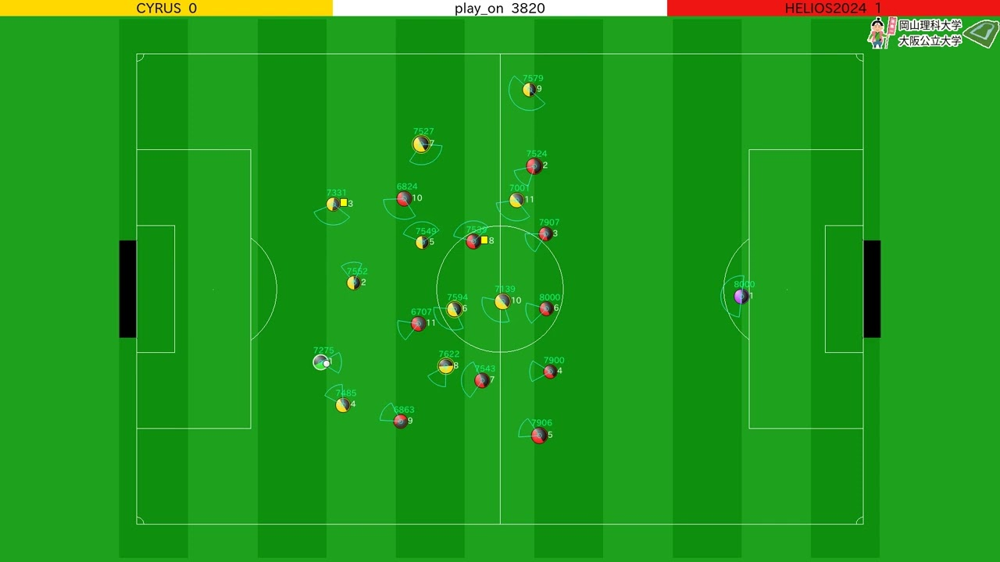

Soccer simulation 2D is a league in RoboCup that simulates a soccer game in a 2D environment. The game is played by two teams of twelve autonomous software agents (one coach and eleven players). The agents are controlled by programs that communicate with a server using UDP sockets. The server simulates the game and sends the agents the current state of the game and the actions they can perform.
<!-- truncate -->

The RoboCup 2D Simulated Soccer League is the oldest of the RoboCup Soccer Simulation Leagues. It consists of a number of competitions with computer simulated soccer matches as the main event.

There are no physical robots in this league but spectators can watch the action on a large screen, which looks like a giant computer game. Each simulated robot player may have its own play strategy and characteristic and every simulated team actually consists of a collection of programs. Many computers are networked together in order for this competition to take place.

## Rules
In the 2D Simulation League, two teams of eleven autonomous software programs (called agents) each play soccer in a two-dimensional virtual soccer stadium represented by a central server, called SoccerServer. This server knows everything about the game, i.e. the current position of all players and the ball, the physics and so on. The game further relies on the communication between the server and each agent. On the one hand each player receives relative and noisy input of his virtual sensors (visual, acoustic and physical) and may on the other hand perform some basic commands (like dashing, turning or kicking) in order to influence its environment.

The big challenge in the Simulation League is to conclude from all possible world states (derived from the sensor input by calculating a sight on the world as absolute and noise-free as possible) to the best possible action to execute. As a game is divided into 6000 cycles this task has to be accomplished in time slot of 100 ms (the length of each cycle).