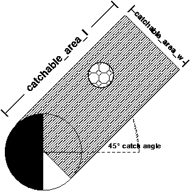

# Catch Model


<div align="center">
  
  
  Catchable area of the goalie when doing a (catch 45)
</div>


The goalie is the only player with the ability to catch a ball. The
goalie can catch the ball in play mode `play_on` in any direction,
if the ball is within the catchable area and the goalie is inside the
penalty area.  If the goalie catches into direction $\varphi$,
the catchable area is a rectangular area of length
**server::catchable_area_l** and width **server::catchable_area_w** in
direction $\varphi$ (see cases`catcharea`).<!----correct this refrence---->
The ball will be caught with probability
**server::catch_probability**, if it is inside this area (and it will
not be caught if it is outside this area).
For the current values of catch command parameters see cases`param-goaliecatch`:<!----correct this refrence---->

| Parameter in `server.conf` and `player.conf`       | Value      |
|-----------------------------------------------------|------------|
| server::catchable_area_l                             | 2.0       |
| server::catchable_area_w                             | 1.0       |
| server::catch_probability                             | 1.0       |
| server::catch_ban_cycle                              | 5          |
| server::goalie_max_moves                             | 2          |
| player::catchable_area_l_stretch_max                | 1.3        |
| player::catchable_area_l_stretch_min                | 1          |


First time when goalie has been introduced in Soccer Simulation 2D was with server
version 4.0.0:
When a client connects the server with '(init TEAMNAME (goalie)',
the client becomes a goalies. The goalie can use '(catch DIR)' command
that enable to capture the ball.

With server version 4.0.2 another parameter named **server::catch_probability** has
been introduced. This parameter represents the probability that a goalie succeed to
catch the ball by a catch command. (default value: 1.0)

If the goalie successfully catches a ball it is moved adjacent
to and facing the ball and both the goalie and ball have their
velocities set to zero. When the goalie moves, dashes or turns
while the ball is caught, the ball remains adjacent to and
directly in front of the goalie.

The goalie can issue catch commands at any location. If the catch
is successful, and the ball is outside of the penalty area or if
the goalie moves the ball outside of the penalty area and it's still
in the field, an indirect free kick is awarded to the opposing team
at the ball's current location. If a caught ball is moved over the
goal line but not inside the goal, a corner kick is awarded. If a
caught ball is moved into the goal, a goal is awarded.

Later, in server version 14.0.0 a heterogeneous goalie has been introduced. Beginning
with this version online coaches can change the player type of goalie. The
'catchable_area_l_stretch' variable was added to each heterogeneous player type through
two new parameters: player::catchable_area_l_stretch_min (default value: 1.0) and
player::catchable_area_l_stretch_max (default value: 1.3)

The following pseudo code shows a trade-off rule of the catch model:

```cpp
// catchable_area_l_stretch is the heterogeneous parameter, currenlty within [1.0,1.3]

double this_catchable_are_delta = server::catchable_area_l * (catchable_area_l_stretch - 1.0)
double this_catchable_area_l_max = server::catchable_area_l + this_catchable_are_delta
double this_catchable_area_l_min = server::catchable_area_l - this_catchable_are_delta

if (ball_pos is inside the MINIMAL catch area)
{
    // the MINIMAL catch area has a length of this_catchable_area_l_min and width server::catchable_area_w goalie
    // catches the ball with probability server::catch_probability (which is 1.0 by default)
}
else if (ball_pos is beyond the MAXIMAL (stretched) area)
{
    // the MAXIMAL catch area has a length of this_catchable_area_l_max and width server::catchable_area_w goalie
    // definitely misses the ball
}
else
{
    double ball_relative_x = (ball_pos - goalie_pos).rotate(-(goalie_body + catch_dir)).x
    double catch_prob = server::catch_probability
                        - server::catch_probability
                          * (ball_relative_x - this_catchable_area_l_min)
                          / (this_catchable_area_l_max - this_catchable_area_l_min)
    // goalie catches the ball with probability catch_prob it holds: catch_prob is in [0.0,1.0]
}
```

If a catch command was unsuccessful, it takes **server::catch_ban_cycle** cycles until another catch command can be used (catch commands during this time have simply no effect).
If the goalie succeeded in catching the ball, the play mode will change to `goalie_catch_ball_[l|r]` first and `free_kick_[l|r]`, after that during the same cycle.
Once the goalie caught the ball, it can use the **move** command to move with the ball inside the penalty area.
The goalie can use the **move** command **server::goalie_max_moves** times before it kicks the ball.
Additional **move** commands do not have any effect and the server will respond with `(error too_many_moves)`.
Please note that catching the ball, moving around, kicking the ball a short distance and immediately catching it again to move more than **server::goalie_max_moves** times is considered as ungentlemanly play.

Starting with server version 15.0.0 an improvement of the catch model has been introduced:

- If goalie fails to catch the ball beyond the fuzzy catchable area, the ball has no effect. (same as the previous model)
- If goalie fails to catch the ball within a fuzzy catchable area, the ball is accelerated to the catch command direction. (it is similar to the ball bouncing from the wall that the normal vector's direction is same as the catch command direction)
